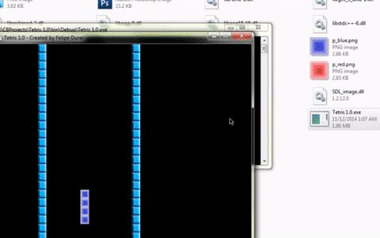
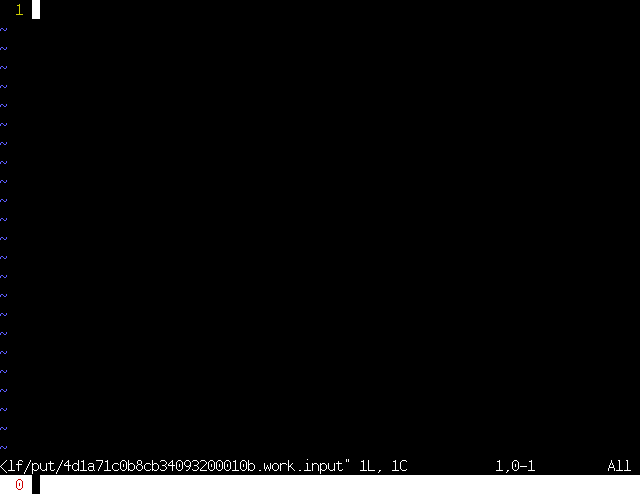
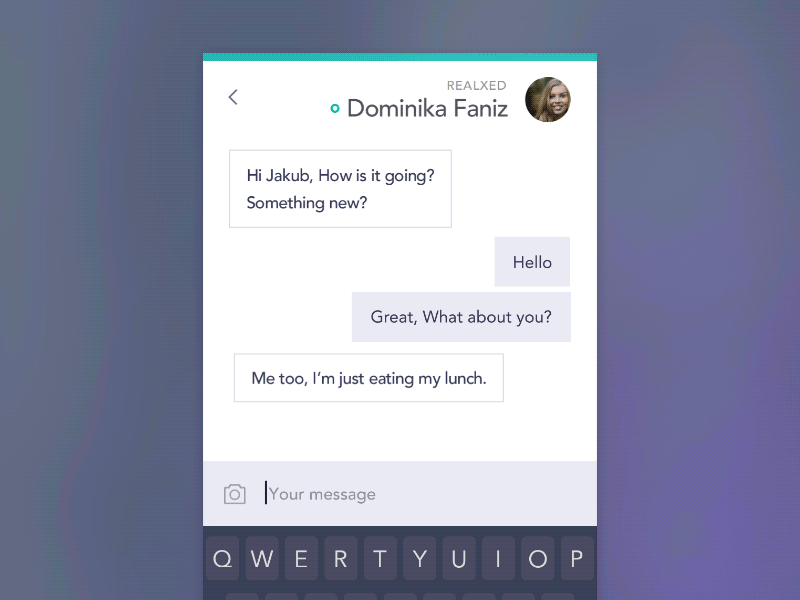
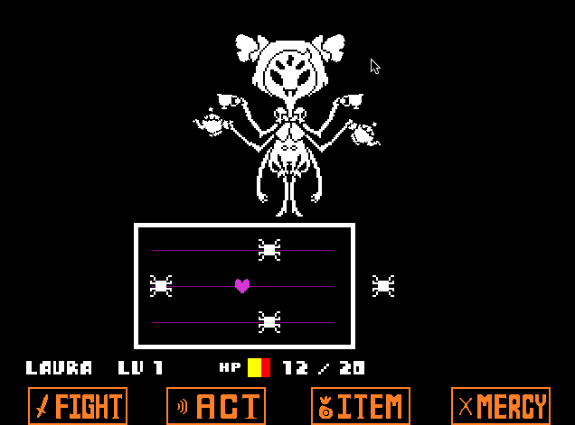

#Preface

So...When most people try to learn code in 2016...

Notes:
Warm up the audience

===

#You expect this...

Notes:
People expect to just bang out code. they expect it to be easy, and that they will make super awesome programs and make a bunch of money

===

#But, you get this..

Notes:
Your gonna break your computer installing linux, your gonna make simple not that cool "Fizz Buzz" in a terminal window. And your gonna go to college and be bored

===

#So, how do you get this?

Notes:
So, how do you become that super cool hacker? How do you make that super cool app? How do you make the video game of your dreams?
